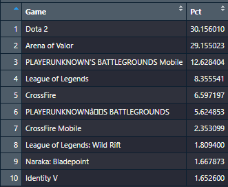
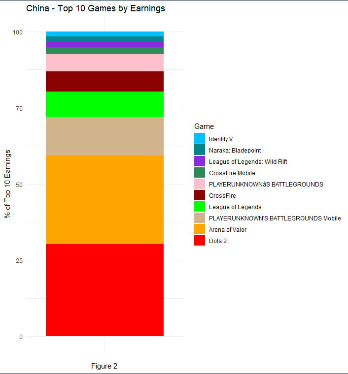
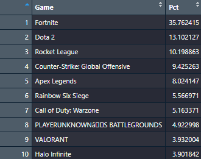
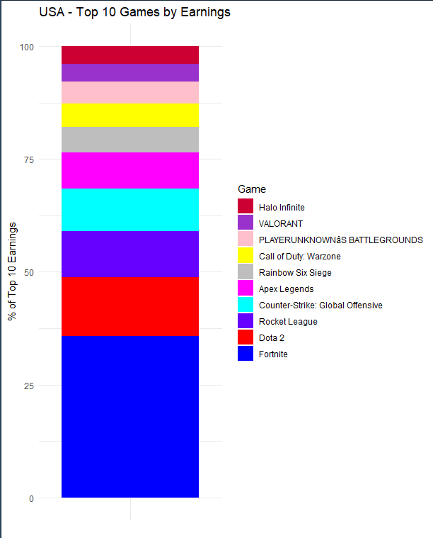
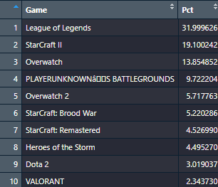
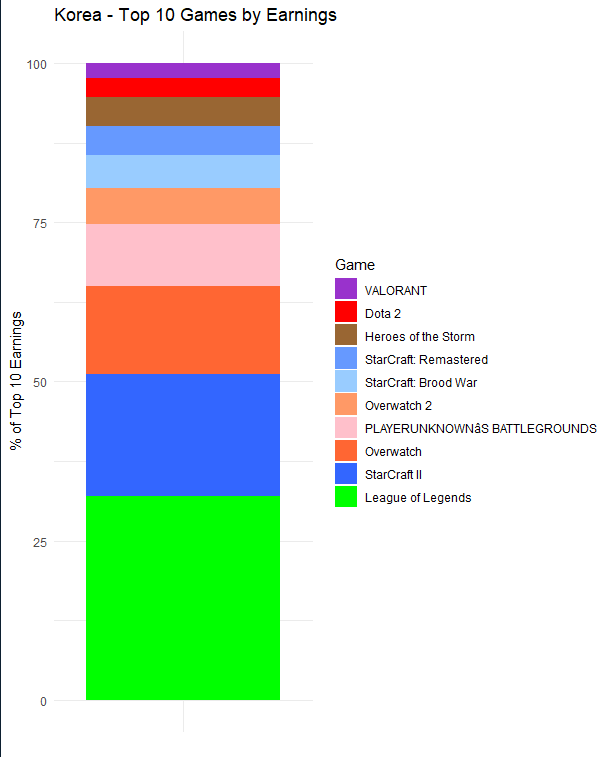

# Introduction

eSports is a really interesting topic because of how global it is. Almost anyone in the world can compete and there's competition in almost every game imaginable, and when we saw that the eSports earnings website was one of the data sources available for this project, we were interested.\
This data contains the eSports earning for players for the past 20+ years. It contains data from every major to mid sized eSport, from players from pretty much every country in the world. This data was chosen due to it being really rich and having a lot of different aspects to analyze. The way this data was obtained was from https://www.esportsearnings.com/, and all the data in this website was entered manually, getting it from forums, tournament organizers, and all made sure to be accurate.\
This data follows the FAIR principles because this data is pretty findable since you can go to that website and find all the data that I used, its accessible since its free and anyone can use it for whatever they need, its interoperable because you can modify it and pretty easily, and it's reusable because the data will stay up and anyone can use it.\
This follows the CARE principles because it is for collective benefit since it's cool and interesting and helps people understand how everyone can be good at esports, this data has authority to control because people are empowered by it, and its fair. It's responsible because it has no bias, and it accurately represents groups. It's ethical because it hurts no one and it makes sure to treat everyone equally.\
The specific attributes of this data that im focused on, is specifically the geographical differences between players of different games, and what regions excel in different games. There's a lot of data on different players and where they're from, and this could make a really interesting analysis.

# First Analysis

The first data analysis I decided to do, was to take the statistics of the top earning countries of all time and analyze it. I took the data from eSports earnings which gives the highest earning countries, with the amount of money, and how many players in each country. I was really curious what countries in general are the best at eSports since it could be anything. Tidying this in R gave me this data: {width="80%"}\
Using the tidied data from this graph, I was able to create a visualization using a bar graph, which gave me this:\
{width="80%"}\
Alt text: This graph is a horizontal bar graph that demonstrates the highest earning countries in eSports. At the very top, we have China, United States Korea, Russia, and Brazil. Then, it decreases pretty linearly. China has earned around 350 millon USD, and has a pretty exponential decrease.\
There's a few conclusions I've reached from this data. Firstly, a country having a bigger population has a direct correlation with how much success a country has in eSports. China, United States, Russia, And Brazil are some of the biggest countries in the world, and this makes sense because if there's more people in a country, there's going to be more people competing.

# Second Analysis

The second analysis I've decided to do is a stacked bar chart of the top 10 games per country, looking specifically at the top three countries (China, United States, Korea). I took the data from eSportsearnings, which shows top games per country. I made a separate table and graph for each of the three countries.

{width="255"}

{width="433"}

{width="259"}

{width="433"}

{fig-align="left" width="238" height="189"}

{width="415"}

Alt Text: These stacked bar graphs show the differences in game preference across the three countries. In China, the eSport that has made the most money is Dota 2, which is responsible for over 30% of the total eSports earnings. Dota 2 also makes an appearance on the other two countries top 10, coming second only to Fortnite in the United States. Fortnite, which only appears on the United States graph, makes up over 30% of the country's top 10 earnings. In Korea, the most popular game is League of legends, which also makes up over 30% of the country's total earnings. It's interesting how in each of these charts, the top game makes up a very similar percentage of the total earnings (around 30%). These graphs also show some intriguing geographical differences between the three countries. For example, in China, there are five mobile games in the top 10 (PUBG Mobile, Crossfire Mobile, Identity V, League of Legends Wild Rift, and Arena of Valor), which all together make up nearly 50% of the country's total eSports earnings. In contrast, neither the United States or Korea have any mobile games in their top 10. Lastly, there are only two games that appear in all three graphs, PUBG and Dota 2, indicating the global appeal of those games.

# Author Contribution

Isabella A.: GitHub repository setup, Quarto document setup, data analysis 1, Plan document. Adam R.: Presentation setup, GitHub contributions, data analysis 2, data review. #Code Appendix

```{r}
# Code by Isabella. Reviewed by Adam.
# Using the Google code formatting guidelines.
library(tidyverse)
library(scales)

earnings_raw <- tribble(
  ~rank, ~country, ~total_earnings, ~players,
  1, "China", "$333,124,853.95", 9387,
  2, "United States", "$302,289,323.81", 29501,
  3, "Korea, Republic of", "$157,154,934.92", 5987,
  4, "Russian Federation", "$98,801,881.46", 5900,
  5, "Brazil", "$74,212,435.26", 6058,
  6, "Denmark", "$64,982,127.80", 2212,
  7, "France", "$63,290,937.28", 6705,
  8, "Sweden", "$59,203,302.47", 3367,
  9, "Germany", "$53,321,254.74", 6987,
  10, "Canada", "$50,919,206.73", 4395,
  11, "United Kingdom", "$50,674,463.56", 5747,
  12, "Japan", "$43,535,932.56", 4004,
  13, "Ukraine", "$41,266,588.03", 1727,
  14, "Australia", "$34,849,291.99", 4639,
  15, "Finland", "$34,242,302.63", 2216,
  16, "Poland", "$32,938,128.16", 3164,
  17, "Thailand", "$31,614,841.27", 2319,
  18, "Philippines", "$27,381,660.37", 1918,
  19, "Malaysia", "$23,483,101.29", 1723,
  20, "Taiwan, Republic of China", "$23,126,488.07", 1726
)

earnings_tidy <- earnings_raw %>%
  mutate(
    total_earnings = parse_number(total_earnings),
    players = as.integer(players),
    earnings_per_player = total_earnings / players
  ) %>%
  arrange(desc(total_earnings))

table_caption <- paste(
  "Table 1. Top 20 countries by total eSports earnings.",
  "Columns include rank, country, total earnings (USD), number of players,",
  "and earnings per player (USD)."
)

table_alt_text <- paste(
  "A table listing the top 20 countries by total eSports earnings.",
  "China is highest at about 333 million USD, followed by the United States",
  "at about 302 million USD, then Korea, Republic of at about 157 million USD.",
  "The table also shows players and earnings per player for each country."
)

earnings_table <- earnings_tidy %>%
  transmute(
    Rank = rank,
    Country = country,
    `Total Earnings (USD)` = dollar(total_earnings, accuracy = 1),
    Players = comma(players),
    `Earnings per Player (USD)` = dollar(earnings_per_player, accuracy = 1)
  )

cat(table_caption, "\n")
cat("Alt text: ", table_alt_text, "\n\n", sep = "")
print(earnings_table, n = Inf)

plot_caption <- paste(
  "Figure 1. Total eSports earnings by country for the top 20 earning countries",
  "(USD, shown in millions)."
)

earnings_plot <- ggplot(
  earnings_tidy,
  aes(x = reorder(country, total_earnings), y = total_earnings)
) +
  geom_col(fill = "#2C7FB8") +
  coord_flip() +
  scale_y_continuous(labels = label_dollar(scale = 1e-6, suffix = "M")) +
  labs(
    title = "Highest Earning Countries in eSports",
    x = NULL,
    y = "Total Earnings (USD, Millions)",
    caption = plot_caption
  ) +
  theme_minimal(base_size = 12) +
  theme(
    plot.title = element_text(size = 11),
    axis.title = element_text(size = 9),
    axis.text = element_text(size = 8),
    plot.caption = element_text(size = 8)
  )

cat("\n", plot_caption, "\n\n", sep = "")
print(earnings_plot)
```

```{r}
# Code by Adam. Reviewed by Isabella.
library(tidyverse)
library(rvest)
library(knitr)

china_games <- read_html("https://www.esportsearnings.com/countries/cn") %>%
  html_nodes("table") %>% html_table(fill = TRUE) %>% .[[1]] %>%
  mutate(Country = "China")

usa_games <- read_html("https://www.esportsearnings.com/countries/us") %>%
  html_nodes("table") %>% html_table(fill = TRUE) %>% .[[1]] %>%
  mutate(Country = "USA")

korea_games <- read_html("https://www.esportsearnings.com/countries/kr") %>%
  html_nodes("table") %>% html_table(fill = TRUE) %>% .[[1]] %>%
  mutate(Country = "Korea")

china_top10 <- china_games %>% 
  rename(Rank = 1, Game = `Game Name`, Earnings = `Total (Game)`) %>% 
  mutate(Earnings = parse_number(Earnings)) %>% 
  slice_max(Earnings, n = 10) %>% 
  mutate(Pct = Earnings / sum(Earnings) * 100)

usa_top10 <- usa_games %>% 
  rename(Rank = 1, Game = `Game Name`, Earnings = `Total (Game)`) %>% 
  mutate(Earnings = parse_number(Earnings)) %>% 
  slice_max(Earnings, n = 10) %>% 
  mutate(Pct = Earnings / sum(Earnings) * 100)

korea_top10 <- korea_games %>% 
  rename(Rank = 1, Game = `Game Name`, Earnings = `Total (Game)`) %>% 
  mutate(Earnings = parse_number(Earnings)) %>% 
  slice_max(Earnings, n = 10) %>% 
  mutate(Pct = Earnings / sum(Earnings) * 100)

View(china_top10 %>% select(Game, Pct) %>% arrange(desc(Pct)))
View(korea_top10 %>% select(Game, Pct) %>% arrange(desc(Pct)))
View(usa_top10 %>% select(Game, Pct) %>% arrange(desc(Pct)))

game_colors <- c(
  "Dota 2" = "red",
  "Arena of Valor" = "orange",
  "PLAYERUNKNOWN'S BATTLEGROUNDS Mobile" = "tan",
  "League of Legends" = "green",
  "CrossFire" = "darkred",
  "PLAYERUNKNOWNâ\u0080\u0099S BATTLEGROUNDS" = "pink",
  "CrossFire Mobile" = "seagreen",
  "League of Legends: Wild Rift" = "blueviolet",
  "Naraka: Bladepoint" = "turquoise4",
  "Identity V" = "deepskyblue",
  "Fortnite" = "blue",
  "Rocket League" = "purple",
  "Counter-Strike: Global Offensive" = "cyan",
  "Apex Legends" = "deeppink",
  "Rainbow Six Siege" = "grey",
  "Call of Duty: Warzone" = "yellow",
  "VALORANT" = "springgreen",
  "Halo Infinite" = "magenta3",
  "StarCraft II" = "royalblue",
  "Overwatch" = "tomato",
  "Overwatch 2" = "wheat4",
  "StarCraft: Brood War" = "paleturquoise",
  "StarCraft: Remastered" = "skyblue2",
  "Heroes of the Storm" = "lightsalmon3"
)
china_top10 <- china_top10 %>% mutate(Pct = Earnings / sum(Earnings) * 100)
usa_top10 <- usa_top10 %>% mutate(Pct = Earnings / sum(Earnings) * 100)
korea_top10 <- korea_top10 %>% mutate(Pct = Earnings / sum(Earnings) * 100)

ggplot(china_top10, aes(x = "", y = Pct, fill = reorder(Game, Pct))) +
  geom_col() +
  scale_fill_manual(values = game_colors) +
  labs(title = "China - Top 10 Games by Earnings", x = NULL, y = "% of Top 10 Earnings", fill = "Game") +
  theme_minimal()

ggplot(usa_top10, aes(x = "", y = Pct, fill = reorder(Game, Pct))) +
  geom_col() +
  scale_fill_manual(values = game_colors) +
  labs(title = "USA - Top 10 Games by Earnings", x = NULL, y = "% of Top 10 Earnings", fill = "Game") +
  theme_minimal()

ggplot(korea_top10, aes(x = "", y = Pct, fill = reorder(Game, Pct))) +
  geom_col() +
  scale_fill_manual(values = game_colors) +
  labs(title = "Korea - Top 10 Games by Earnings", x = NULL, y = "% of Top 10 Earnings", fill = "Game") +
  theme_minimal()
```

# Citation

“Esports Earnings: Prize Money / Results / History / Statistics.” Esports Earnings, http://www.esportsearnings.com. Accessed 28 Apr. 2026.
